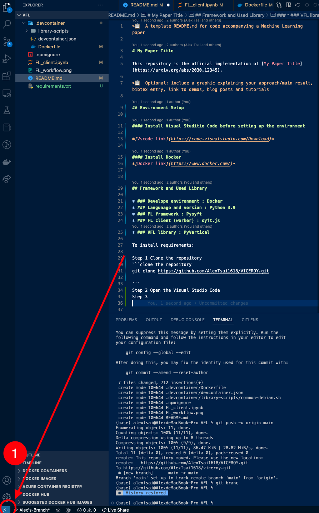
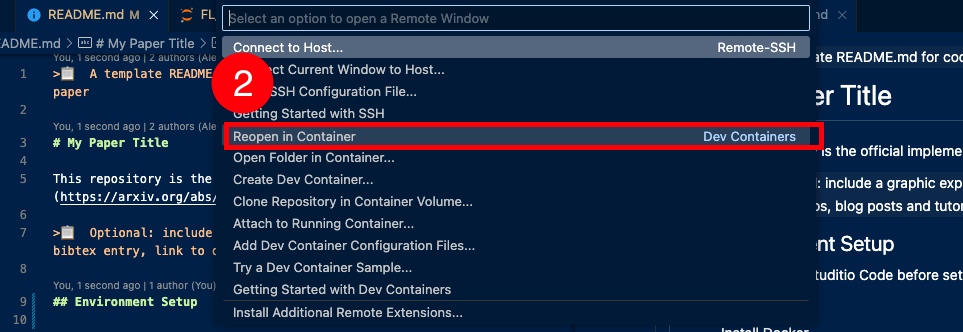
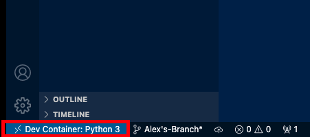

>📋  A template README.md for code accompanying a Machine Learning paper

# VICEROY

This repository is the official implementation of [VICEROY](https://arxiv.org/abs/2030.12345). 

>📋  Optional: include a graphic explaining your approach/main result, bibtex entry, link to demos, blog posts and tutorials

### Todo

- [x] Work on Github Repo
- [ ] Implement Client worker Code
- [ ] Include PCA
- [ ] Include differential privacy
- [ ] Implement VFL concept


## Environment Setup

#### Install Visual Studitio Code before setting up the environment

*[Vscode link](https://code.visualstudio.com/Download)*

#### Install Docker 
*[Docker link](https://www.docker.com/)*


## Framework and Used Library

* ### Develope environment : Docker
* ### Languaage and version : Python 3.9
* ### FL framework : Pysyft
* ### FL client (worker) : syft.js
* ### VFL library : PyVertical

To install requirements:

Step 0 Create an empty Folder call VFL and open it with Visual Studio Code

Step 1 Clone the repository
```clone the repository 
git clone https://github.com/AlexTsai1618/VICEROY.git

```
Step 2 launch docker

Step 3 Launch devcontainer

* Step 3-1
Go to the bottom left side and click it
    

* Step 3-2
Select the Reopen in Container to launch the devcontainer

    

* Result
Check whether the devcontainer is successfully
    

>📋  Describe how to set up the environment, e.g. pip/conda/docker commands, download datasets, etc...

## Training

To train the model(s) in the paper, run this command:

```train
python train.py --input-data <path_to_data> --alpha 10 --beta 20
```

>📋  Describe how to train the models, with example commands on how to train the models in your paper, including the full training procedure and appropriate hyperparameters.

## Evaluation

To evaluate my model on ImageNet, run:

```eval
python eval.py --model-file mymodel.pth --benchmark imagenet
```

>📋  Describe how to evaluate the trained models on benchmarks reported in the paper, give commands that produce the results (section below).

## Pre-trained Models

You can download pretrained models here:

- [My awesome model](https://drive.google.com/mymodel.pth) trained on ImageNet using parameters x,y,z. 

>📋  Give a link to where/how the pretrained models can be downloaded and how they were trained (if applicable).  Alternatively you can have an additional column in your results table with a link to the models.

## Results

Our model achieves the following performance on :

### [Image Classification on ImageNet](https://paperswithcode.com/sota/image-classification-on-imagenet)

| Model name         | Top 1 Accuracy  | Top 5 Accuracy |
| ------------------ |---------------- | -------------- |
| My awesome model   |     85%         |      95%       |

>📋  Include a table of results from your paper, and link back to the leaderboard for clarity and context. If your main result is a figure, include that figure and link to the command or notebook to reproduce it. 


## Contributing

>📋  Pick a licence and describe how to contribute to your code repository. 